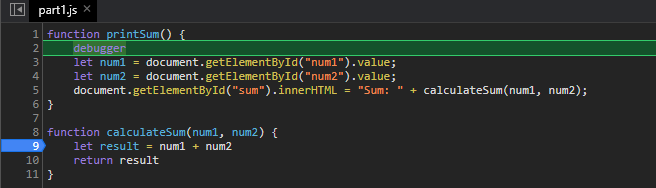
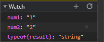
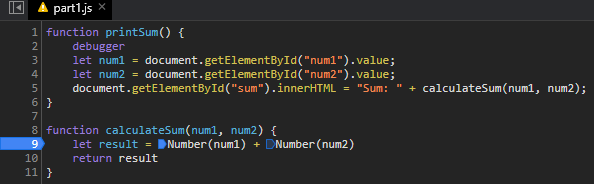

##### Debugging
1. 
2. 
3. The bug is that the input is not converted to numbers from strings, so adding the 2 values performs string concatenation.
4. 

##### Network Tab
1. `citylots.json`
2. `part2.js`
3. 11.7mb
4. 65ms
5. Mozilla/5.0 (Windows NT 10.0; Win64; x64) AppleWebKit/537.36 (KHTML, like Gecko) Chrome/88.0.4324.104 Safari/537.36
6. Apache
7. Tue, 26 Jan 2021 22:14:13 GMT
8. application/json
9. `fetchData()`